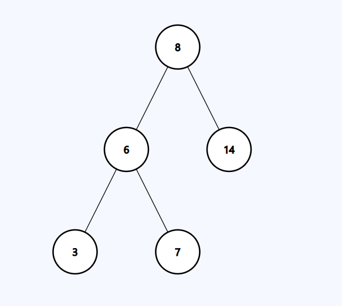

# BinarySearchTree

Un proyecto en C++ que implementa un **Árbol Binario de Búsqueda (BST)**, proporcionando funciones estándar para gestionar y manipular datos almacenados en dicho árbol. Este repositorio está diseñado para demostrar cómo funciona un BST y cómo se implementan sus funciones principales.

## Tabla de Contenidos

1. [Descripción](#descripción)
3. [Funciones](#funciones)
4. [Implementación](#implementación)
5. [Contribuciones](#contribuciones)
6. [Licencia](#licencia)

## Descripción

El **Árbol Binario de Búsqueda (BST)** es una estructura de datos que facilita el almacenamiento y la búsqueda eficiente de elementos. En un BST, cada nodo tiene un valor mayor que todos los valores en su subárbol izquierdo y menor que todos los valores en su subárbol derecho.



## Funciones

- **insert**: Inserta un nuevo nodo en el árbol.
  ```cpp
  Node<T> *insert(const T &data, Node<T> *node) {
    if (node == nullptr)
        return new Node<T>(data);
    if (data < node->data)
        node->left = insert(data, node->left);
    else
        node->right = insert(data, node->right);
    return node;
  }
- **search**: Buscar un nodo en el árbol.
  ```cpp
  Node<T> *search(const T &data, Node<T> *node) {
    if (node == nullptr)
        return nullptr;
    if (data == node->data)
        return node;
    auto aux_node = data < node->data ? node->left : node->right;
    return search(data, aux_node);
  }
- **size**: Devuelve el número total de nodos en el árbol.
  ```cpp
  int size(Node<T> *node) {
    if (node == nullptr)
        return 0;
    return 1 + size(node->left) + size(node->right);
  }
- **height**: Devuelve la altura del árbol.
  ```cpp
  int height(Node<T> *node) {
    if (node == nullptr)
        return 0;
    return 1 + std::max(height(node->left), height(node->right));
  }
- **inorder**: Realiza un recorrido en orden (izquierda, raíz, derecha).
  ```cpp
  void inorder(Node<T> *node) {
    if (node == nullptr)
        return;
    inorder(node->left);
    std::cout << node->data << " ";
    inorder(node->right);
  }
- **preorder**: Realiza un recorrido en preorden (raíz, izquierda, derecha).
  ```cpp
  void preorder(Node<T> *node) {
    if (node == nullptr)
        return;
    std::cout << node->data << " ";
    inorder(node->left);
    inorder(node->right);
  }
- **postorder**: Realiza un recorrido en postorden (izquierda, derecha, raíz).
  ```cpp
  void postorder(Node<T> *node) {
    if (node == nullptr)
        return;
    inorder(node->left);
    inorder(node->right);
    std::cout << node->data << " ";}

## Implementación

Para usar este proyecto, clona el repositorio y ejecuta el **main.cpp** desde de CLion.
```bash
git clone https://github.com/Bryannsss140101/BinarySearchTree.git
cd BinarySearchTree
```
## Contribuciones

¡Las contribuciones son bienvenidas! Si encuentras algún bug o tienes sugerencias de mejora, no dudes en abrir un issue o hacer un pull request. Asegúrate de seguir estas pautas:

1. Forkea el repositorio.
2. Crea una nueva rama **(git checkout -b feature/new-functionality)**.
4. Realiza tus cambios y haz commit **(git commit -m 'prefix: Type of functionality')**.
6. Haz push a tu rama **(git push origin feature/new-functionality)**.
8. Crea un pull request.

## Licencia

Este proyecto está licenciado bajo la **Licencia MIT**. Para más detalles, consulta el archivo [LICENSE](lic/LICENSE.txt).
